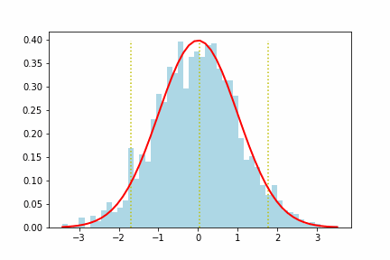
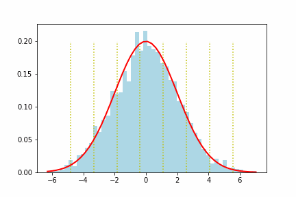
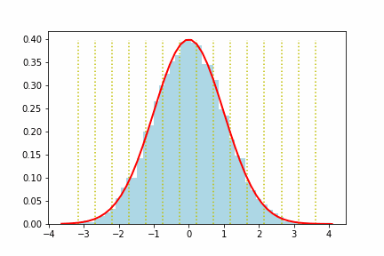

# Lloyds Algorithm Implementation
This repository contains of a simple implementaion of Lloyds algorithm to quantize a sample. In this implementaion we use gaussian distribution as an example.

This algorithm used to quantize diffrent distribiution as a non-uniform quantization. 

For example for three diffrent of inputs we can get a process like this:

```
Guasian Sigma = 1.0, Number of Bits in Quantizer = 2, Number of Samples = 2000
```

```
Guasian Sigma = 2.0, Number of Bits in Quantizer = 3, Number of Samples = 2000
```

```
Guasian Sigma = 1.0, Number of Bits in Quantizer = 4, Number of Samples = 10000
```


## Files 
* `Lloyds.ipynb` : jupyter notebook of all implementains (algorithm+plot+animation)
* `Lloyds.ipy` : python export of above notebook